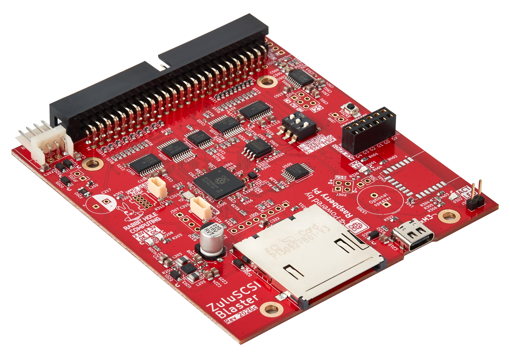

ZuluSCSI®は、SCSI-1およびSCSI-2の両方に対応するSCSIコンピュータストレージエミュレーションプラットフォームです。ファイルベースのSCSI HDDおよびCD-ROMイメージを使用します。2025年の新製品である**ZuluSCSI Blaster**は、最新のRP2350Bを活用し、オプションのRed Book CDオーディオ再生や、互換性のあるClassic MacintoshおよびAmigaコンピュータ向けのWi-Fi Ethernetを含む、追加のI/O機能を提供します。ハードドライブおよびCD-ROMドライブのイメージは、標準的なFAT32またはexFATフォーマットのSDカードに保存され、ブロックデバイスとしてオペレーティングシステムに認識されます。

## ZuluSCSI Blasterの特徴

* ナロー**Ultra SCSI** (20MB/sec) タイミング、およびSCSI-1、SCSI-2のサポート
* 最大**18 MB/sec**の読み取り速度、11 MB/secの書き込み速度 (ZuluSCSI Blasterベースのモデル)
* USB-Cコネクタ
* 最大15.8 **MB**のROMドライブをサポート（1.44MBフロッピーディスク12枚分以上）
* CD-ROM、光磁気ディスク (MO)、リムーバブルメディア (SyQuest/Jazスタイル)、SCSIフロッピーなど、最大7台のSCSIデバイスを同時にエミュレート
* オプションのRM2ラジオモジュールプラグインによる[DaynaPORT SCSI Ethernet Wi-Fiエミュレーション](https://github.com/ZuluSCSI/ZuluSCSI-firmware/wiki/WiFi-DaynaPORT-Ethernet-emulation)
* オプションのDACボードプラグインによるRed Book CDオーディオエミュレーション
* [SCSIイニシエータモード](https://github.com/ZuluSCSI/ZuluSCSI-firmware/wiki/ZuluSCSI-Initiator-Mode)のサポート（ZuluSCSI BlasterがUSB経由でSCSIドライブの内容に[USBマスストレージ](https://github.com/ZuluSCSI/ZuluSCSI-firmware/wiki/USB-Mass-Storage)としてUSB 1.1速度でアクセス可能）
* ファームウェア更新は簡単です。SDカードにファイルを置くだけです
* テキストベースのiniファイル (ZuluSCSI.ini) を使用して高度に設定可能
* 外付けアクセスLEDを取り付けるためのピンヘッダー
* ホストから供給される場合、SCSIターミネーションパワーでの動作が可能
* SCSIターミネーションはDIPスイッチで制御

#### ファームウェアの起源とライセンス

オープンソースの[ZuluSCSI®ファームウェア](https://github.com/zuluscsi/zuluscsi-firmware)は、[GPLv3](https://www.gnu.org/licenses/gpl-3.0.en.html)の下でライセンスされており、以下の2つのGPL 3ライセンスソースから派生しています。

* [SCSI2SD V6](http://www.codesrc.com/gitweb/index.cgi?p=SCSI2SD-V6.git;a=summary)
* [BlueSCSI V1](https://github.com/erichelgeson/BlueSCSI) (これは[ArdSCSIno-stm32](https://github.com/ztto/ArdSCSino-stm32)から派生しています)
